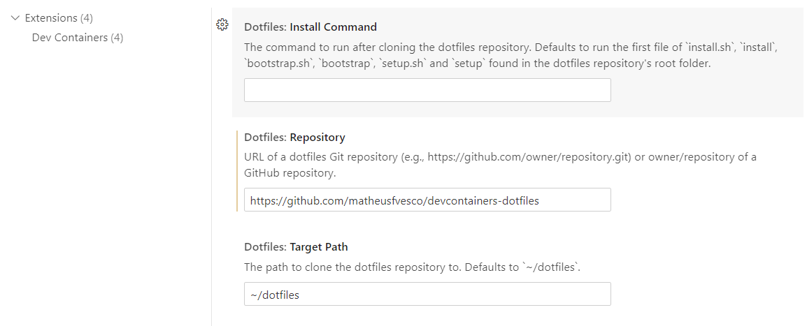

# devcontainers-dotfiles
My own dotfiles, meant to be used with devcontainers and, therefore, made with simplicity in mind.

The install script **DELETES** the `.zshrc`, `.aliases` and `~/.config/starship.toml` files from your directory, and replaces them with symlinks to this repository's dotfiles. It also changes the default shell to zsh.

Currently, it contains:
* **.zshrc**: sources both .aliases and .aliases.local if present, and runs starship at the end of the file.
* **.aliases**: aliases for common commands (e.g., `alias mkdir="mkdir -pv"`)
* **.config/starship.toml**: a Starship config i like to use, with my own modifications.

All of the files are created as symbolic links, to facilitate my own testing during the development of my dotfiles inside a dev container.

A `~/.aliases.local` file can be used to add your own project specific aliases.

## Installation

Just copy the URL of this repository inside the dotfiles.Repository setting inside your VSCode. VSCode should take care of the rest.

